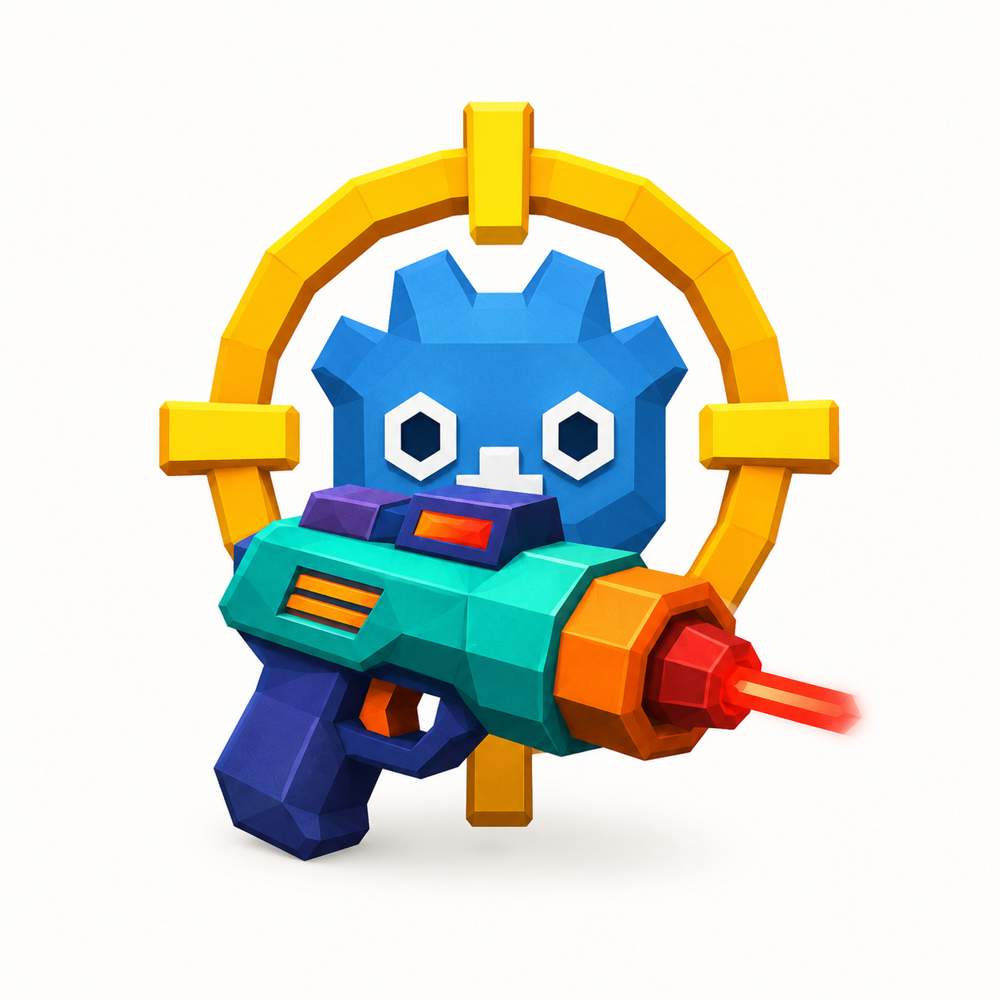

  

<h1 align="center">Laser Tag Map Evaluation Tool</h1>

Drop-in Godot 4 add-on that answers one question about your greybox level:
<b>does this map support a firefight?</b> 
Pill players, manual hitscan lasers, collision-blocked fire, and
machine-readable map reports.

---

## 60-second start

1. Copy `addons/laser_tag_tool/` into your Godot 4 project.
2. Open your greybox level and add two things:
   - a `Marker3D` named **`LT_PlayerSpawn`**
   - a `Node3D` named **`LT_EnemySpawnPoints`** with a few `Marker3D`
     children
   (Level geometry must have collision on **Layer 1**.)
3. Instance `addons/laser_tag_tool/scenes/LT_MapEvalHarness.tscn` into the
   level and press **Play**.

That's it. WASD to move, **Left Mouse to fire** (one press = one shot),
**Tab** for tracer settings, **N** to toggle enemies, **R** to reset.
No project settings, no input map edits, no autoloads — the harness
registers everything it needs at runtime.

Want to try it before touching your own level? Play
`addons/laser_tag_tool/scenes/demo/LT_DemoGreybox.tscn`.

## What you get

- **Manual mode** — run your map, shoot, get shot. Crosshair feedback,
  health pips, debug tracers, enemy state labels, shot audio.
- **Headless mode** — CI-ready evaluation: bots run the map N times and
  you get a JSON/CSV report with a 0–100 score, PASS/WARN/FAIL grade,
  overexposed/blind zone coordinates, and exit codes for pipelines.
- **Coop cosmetic spike** — per-player tracer color + style that
  persists to disk and replicates so friends see *your* lasers and
  *your* tinted ghost. Transport-agnostic: rides any `MultiplayerPeer`
  your game already uses, or your own protocol via a ~30-line adapter.
  (Gameplay state — enemies, damage — is **not** networked yet; each
  peer runs its own sim. That part is Phase 5.)

## Change your laser live

Press **Tab** in-game: pick a color, pick a style
(`solid` / `dashed` / `rail`), set your name. Changes apply instantly,
save to disk, and — when connected — every other player watches your
tracers change in real time.

## Full documentation

Setup details, collision layer plan, headless CLI flags, scoring
breakdown, scenario tuning, and the network adapter contract:
**[addons/laser_tag_tool/README.md](addons/laser_tag_tool/README.md)**

## CI

`.github/workflows/map-eval.yml` lints all GDScript and runs a seeded
headless evaluation of the demo level on every push.

---

<i>A passing laser tag test is a combat readiness
signal, not "map is done."</i>

